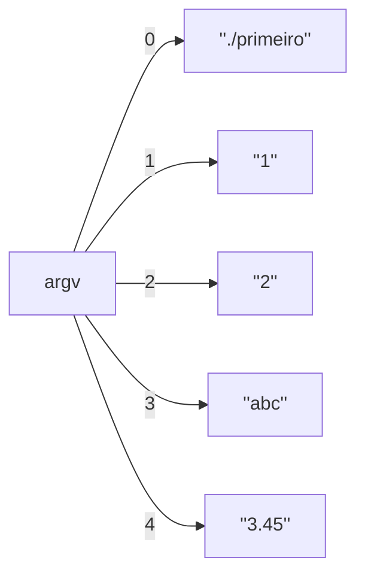

# Passagem de argumentos pela linha de comando para programas na linguagem C
   

By André Leon S. Gradvohl, Dr. ([gradvohl@unicamp.br](mailto:gradvohl@unicamp.br))

Este é um breve tutorial para a passagem de argumentos pela linha de comando para programas na linguagem C. A vantagem dessa passagem de argumentos é informar, já no início do programa, quais são os dados básicos necessários para seu funcionamento. Se o programa tiver todos os dados que precisa já no seu início, não será preciso ficar solicitando mais dados ao usuário ao longo da execução do programa.

Destacamos que os programas exemplo que estão neste repositório foram escritos para a linguagem C para o sistema operacional Linux. Os conceitos são os mesmos para outros sistemas operacionais. Mas, as bibliotecas utilizadas podem ser um pouco diferentes.

Dividimos esse tutorial em duas partes. A [primeira parte](#passagem-de-argumentos-pela-linha-de-comando) é bem básica, para aqueles que estão iniciando ou que querem fazer um programa rápido, no qual o usuário já sabe de antemão a quantidade e o tipo dos argumentos que o programa espera receber.

A [segunda parte](#passagem-de-argumentos-com-a-função-getopt) é mais avançada e utiliza uma biblioteca que permite uma especificação mais profissional dos argumentos que serão passados para o programa.

## Passagem de argumentos pela linha de comando
Para que seu programa receba argumentos da linha de comando, é preciso que a sua função ``main`` tenha a seguinte assinatura:
```c
int main( int argc, char *argv[ ] )
```
Vamos aos detalhes:

``argc`` -- é uma variável do tipo inteiro que contém a quantidade de argumentos passados na chamada do programa. **Importante**: o nome do programa também é um argumento. Portanto, a variável ``argc`` terá sempre um valor maior ou igual a 1.

``argv`` – é uma variável do tipo "ponteiro para vetor de _strings_". Isso significa que ``argv`` é um vetor alocado dinamicamente, cujo tamanho depende da quantidade de argumentos passados pela linha de comando. Cada elemento desse vetor, por sua vez, é uma _string_ que contém um dos argumentos passados para o programa. 

Se você entendeu bem as definições anteriores, pode perceber que:

1. A variável ``argc`` determina o tamanho do vetor ``argv``.
2. A posição zero do vetor ``argv``, isto é ``argv[0]``, armazenará o nome do programa.
3. Todos os argumentos informados ao programa estarão armazenados no vetor ``argv`` na ordem em que foram informados.

Ilustremos esses conceitos básicos com um programa bem simples a seguir. Esse programa foi chamado de ``primeiro.c`` e está disponível neste repositório.
```c
#include <stdio.h>
int main(int argc, char *argv[])
{
  int cont;
  printf("Quantidade de parametros: %d\n", argc);
  for(cont=0; cont < argc; cont++)
  {
    printf("argv[%d]: %s\n", cont, argv[cont]);
  }
  return 0;
}

```
Note, no laço com o comando ``for``, que a variável ``cont`` varia entre zero e menor que ``argc``. Com isso, o comando ``printf`` no laço mostrará o conteúdo da posição indicada por ``cont`` no vetor ``argv``. 

Compile o programa ``primeiro.c`` com a linha de comando a seguir.
```bash
gcc primeiro.c -o primeiro.o
```
Depois de compilado, execute o programa passando vários argumentos pela linha de comando. Eis um exemplo:
```bash
./primeiro.o 1 2 abc 3.45
```
Se tudo funcionou, a saída esperada do programa é a seguinte:
```bash
Quantidade de parametros: 5
argv[0]: ./primeiro.o
argv[1]: 1
argv[2]: 2
argv[3]: abc
argv[4]: 3.45
```
Como comentamos antes, note que o primeiro argumento (que está em ``argv[0]``) é o próprio nome do programa. Em seguida, estão os demais argumentos. Esquematicamente, na memória temos o seguinte:



**É importante destacar que cada um dos argumentos é uma _string_. Afinal, estão armazenados em ``argv``, um vetor de _strings_.** Portanto, se você quiser utilizar os argumentos como valores inteiros ou reais, é preciso convertê-los antes. Vejamos como fazer a seguir.

### Conversão de argumentos de strings para valores numéricos
No exemplo anterior, nossa preocupação era apenas mostrar os argumentos passados pela linha de comando. Agora, faremos um programa um pouco mais complexo para ilustrar a conversão de parâmetros. 

O programa a seguir receberá três parâmetros da linha de comando na seguinte sequência: um número inteiro; um operador entre ``+``, ``-``, ``*`` ou ``/``; e outro número inteiro. No final, o programa mostrará a operação matemática do primeiro número com o segundo.

Vejamos o programa:

```c
#include <stdio.h>
#include <stdlib.h>

int main(int argc, char *argv[])
{
  int operando1;
  int operando2;
  char operacao;

  /*Caso o usuario nao informe a quantidade correta de parametros*/
  if (argc != 4)
  {
    fprintf(stderr,"Uso:\n\t %s numero <operacao> numero\n", argv[0]);
    fprintf(stderr,"\nOnde <operacao> e uma das operacoes matematicas basicas (+, -, *, /)\n");
    return 1;
  }

  operando1 = atoi(argv[1]);

 /* Na string da posicao 2 do vetor argv, isto e, argv[2],
  * vamos pegar o primeiro caractere, isto é, argv[2][0].
  */
  operacao = argv[2][0];

  operando2 = atoi(argv[3]);

  switch(operacao)
  {
   case '+': printf("%d + %d = %d\n", operando1, operando2, operando1 + operando2);
             break;
   case '-': printf("%d - %d = %d\n", operando1, operando2, operando1 - operando2);
             break;
   case '*': printf("%d * %d = %d\n", operando1, operando2, operando1 * operando2);
             break;
   case '/': printf("%d / %d = %.2f\n", operando1, operando2, operando1 / (float) operando2);
             break;
   default: fprintf(stderr,"Operacao (%c) desconhecida.\n", operacao);
            return 1;
  }
  return 0;
}
```
Observe que, no primeiro teste feito no comando ``if``, verificamos se o usuário informou a quantidade correta de argumentos (4 nesse exemplo). Se a quantidade de argumentos, informada na variável ``argc`` for diferente de 4, então o programa emite uma mensagem de erro e termina retornando o código 1.

Se o programa não terminou, então a variável ``operando1`` receberá o primeiro argumento após o nome do programa (que está na variável ``argv[1]``), já convertido de _string_ para número inteiro,  usando a função ``atoi``.  Os detalhes sobre a função ``atoi`` podem ser vistos utilizando o comando ``man atoi``. Note que, para utilizar a função ``atoi``, seu programa deverá adicionar a linha ``#include <stdlib.h>``.

Em seguida, a variável ``operacao`` receberá o segundo argumento após o nome do programa (que está na variável ``argv[2]``). Note que a variável ``operacao`` é do tipo ``char``, isto é, armazena um único caractere; enquanto a variável ``argv[2]`` é uma _string_ que deve conter dois caracteres (o operador, que pode ser ``+``, ``-``, ``*`` ou ``/`` e o terminador de _strings_, o ``\0``). No nosso caso, estamos interessados apenas no primeiro caractere (o operador). Por isso, obtemos a primeira posição (posição zero) do vetor ``argv`` na posição 2. Ou seja, o comando é o seguinte:

```c
operacao = argv[2][0];
```

Por fim, a variável ``operando2`` obtém o terceiro argumento após o nome do programa (que está na variável ``argv[3]``), já convertido de _string_ para número inteiro,  usando a função ``atoi``, na mesma forma que a variável ``operando1`` obteve.


Para ver o exemplo funcionando, compile o programa ``segundo.c`` com a linha de comando a seguir.
```bash
gcc segundo.c -o segundo.o
```
Depois de compilado, execute o programa passando os argumentos pela linha de comando. Eis um exemplo:
```bash
./segundo.o 1 + 2 
```

Faça outros testes e verifique como o programa se comporta.

### Em resumo
Para resumir, fique atento aos tipos de dados que você utilizar para representar os argumentos da linha de comando. Se você for utilizar um determinado argumento como _string_, você poderá utilizar a posição específica da variável ``argv`` sem problemas. Embora minha recomendação seja copiar a posição específica da variável ``argv`` para outra _string_, para não causar confusão.

Se você deseja interpretar um determinado argumento como um número **inteiro**, utilize a função ``atoi`` para converter a posição específica da variável ``argv`` para inteiro.

Se você deseja interpretar um determinado argumento como um número **real**, utilize a função ``atof`` para converter a posição específica da variável ``argv`` para real.

## Passagem de argumentos com a função ``getopt``
Se você já é usuário de interpretadores de linha de comando (_shells_) em Linux -- como o ``bash``, ``csh`` ou ``zsh`` --, deve ter notado que alguns comandos ou programas aceitam uma variedade de argumentos pela linha de comando. Além disso, esses argumentos podem ser passados em qualquer ordem.

Por exemplo, veja a execução do comando ``ls``, que mostra a lista de arquivos.  Você poderá executar esse comando pedindo para listar todos os arquivos (**opção** ``-a``), no formato longo (**opção** ``-l``) e de modo que os humanos possam entender melhor o tamanho dos arquivos, isto é, em _kilo bytes_, _mega bytes_ ou _gigabytes_ (**opção** ``-h``). Assim, você poderá executar o comando ``ls`` da forma a seguir:
```bash
ls -l -a -h
```
Ou de outra forma:
```bash
ls -h -l -a
```
O resultado será o mesmo.

Para interpretar os argumentos corretamente, podemos utilizar a função ``getopt``, que está disponível no cabeçalho ``getopt.h``. A assinatura da função é a seguinte:
```c
int getopt(int argc, char *const argv[], const char *optstring);
```
Onde:

 - ``argc`` e ``argv`` são exatamente as mesmas variáveis que você utilizou na função ``main``; e
 - ``optstring`` contém as letras que serão interpretadas como **opções** para o seu programa.
 
Importante: a partir desse momento, diferenciemos o conceito de **opções** do conceito de **argumentos**. As **opções** serão sempre precedidas de um hífen (``-``). Por exemplo, no comando ``ls -h``, o ``-h`` é uma **opção**.

No cabeçalho ``getopt.h``, além da definição da função ``getopt``, há também a declaração de duas variáveis globais importantes:
```c
extern char *optarg;
extern int optind
```
A primeira, ``optarg``, conterá os argumentos que vêm após as opções. A segunda, ``optind``,  é um índice que controla o acesso a cada uma das posições do vetor ``argv``.

### Exemplo simples
Começaremos com um exemplo bem simples para ilustrar o uso da ``getopt``. Nesse exemplo, o programa trabalhará com três opções (``-a``,  ``-b``, ``-C``). Note que a opção ``-C`` usa letra maiúscula. Veja o programa ``exemploSimplesGetopt.c`` a seguir.

```c
#include <stdio.h>
#include <getopt.h> /* Cabecalho para o getopt.*/
int main(int argc, char *argv[])
{
  int opcao;
  /*Análise de cada uma das opcoes*/
  while ((opcao = getopt(argc, argv, "abC")) != -1)
  {
     switch (opcao)
     {
      case 'a':
        printf("A opcao a foi identificada.\n");
        break;
      case 'b':
        printf("A opcao b foi identificada.\n");
        break;
      case 'C':
        printf("A opcao C foi identificada.\n");
        break;
     }
  }
  return 0;
}
```

Note que para tratar cada uma das opções, é preciso utilizar o comando ``while``, que vai analisar cada uma delas, a cada iteração do laço. Assim, a cada iteração, uma das opções que foi reconhecida será atribuída à variável ``opcao``.

Essa variável opção será analisada pelo comando ``switch`` (dentro do ``while``) que tratará cada uma das opções isoladamente.

Perceba ainda que, o terceiro parâmetro da função ``getopt`` é a _string _ ``abC``. Isso informa que a expectativa é que esse programa aceite uma das três opções (``-a``,  ``-b``, ``-C``) ou uma combinação delas. Por exemplo, ``-ab``, ``-Cb``, ``-a -b -Cb``, ``-aC -b``.

Quando a função ``getopt`` terminar de analisar todas a opções, ela retornará ``-1``. Isso faz com que o laço ``while`` termine.

Compile e execute o programa ``exemploSimplesGetopt.c`` que está no repositório e faça testes para verificar as possibilidades e resultados. Execute com uma opção desconhecida (por exemplo ``-o``) e veja o que acontece.
 
### Exemplo mais elaborado
Mas o que precisamos fazer se quisermos que haja um argumento associado a uma determinada opção? Por exemplo, em um determinado programa poderíamos ter um argumento associado à opção ``-a`` e outro argumento associado a opção ``-b``.  Assim, teriamos o seguinte:
```bash
./exemploComplexGetop.o  -a arquivA.dat -b arquivB.dat
```
Dessa forma, associado à opção ``-a`` está o argumento ``arquivA.dat``, e  associado à opção ``-b`` está associado o argumento ``arquivB.dat``.

Para usar essa estratégia, precisamos adicionar o caractere ``:`` na _string_ passada como parâmetro para a ``getopt``, logo após cada opção. No caso do exemplo proposto, utilizaremos a _string_ "``a:b:``". Note que após o caractere ``a`` tem o caractere ``:`` e também após o  caractere ``b``.

Vamos ao exemplo completo.
```c
#include <stdio.h>
#include <getopt.h> /* Cabecalho para o getopt.*/
int main(int argc, char *argv[])
{
  int opcao;
  /*Análise de cada uma das opcoes*/
  while ((opcao = getopt(argc, argv, "a:b:")) != -1)
  {
     switch (opcao)
     {
      case 'a':
        printf("A opcao a foi identificada.\n");
        printf("Argumento da opcao a: %s\n", optarg);
        break;
      case 'b':
        printf("A opcao b foi identificada.\n");
        printf("Argumento da opcao b: %s\n", optarg);
        break;
     }
  }
  return 0;
}
```

Note que, nesse último exemplo, o argumento para cada opção está na variável ``optarg`` que é uma _string_ (``char *``), conforme indicamos na [seção anterior](#passagem-de-argumentos-com-a-função-getopt).

**Importante:** No exemplo, atente para o fato de que estamos usando a mesma variável ``optarg`` para tratar o argumento de cada opção.  Assim, a cada iteração do laço, o valor anterior dessa variável se perde (na verdade, o endereço para a _string_ armazenada em ``optarg``).  Por isso, é sempre importante copiar o conteúdo do endereço armazenado em optarg para outra _string_. Vejamos o exemplo a seguir, um pouco mais completo.
```c
#include <stdio.h>
#include <getopt.h> /* Cabecalho para o getopt.*/

int main(int argc, char *argv[])
{
  int opcao;
  char *arqA;
  char *arqB;

  /*Análise de cada uma das opcoes*/
  while ((opcao = getopt(argc, argv, "a:b:")) != -1)
  {
     switch (opcao)
     {
      case 'a':
        printf("A opcao a foi identificada.\n");
        arqA = optarg;
        printf("Argumento da opcao a: %s\n", arqA);
        break;
      case 'b':
        printf("A opcao b foi identificada.\n");
        arqB = optarg;
        printf("Argumento da opcao b: %s\n", arqB);
        break;
     }
  }
  printf("Informacao indicada para a opcao A: %s\n", arqA);
  printf("Informacao indicada para a opcao B: %s\n", arqB);
  return 0;
}
```

Perceba que declaramos outras duas variáveis ``arqA`` e ``arqA`` para armazenar o endereço que está em ``optarg``, em cada iteração. 

Agora, compile e execute o programa `exemploComplexGetopt.c` que está no repositório. Faça alguns testes para verificar as possibilidades e resultados. 


## Considerações finais
Este tutorial apresentou apenas as estratégias mais simples para o tratamento de argumentos pela linha de comando. Há muito mais o que pode ser feito para fazer esse tratamento como um profissional. 

Portanto, para se aprofundar sobre o tema, eu sugiro o tutorial [Mead's Guide to getopt](https://azrael.digipen.edu/~mmead/www/mg/getopt/index.html). Esse tutorial vai mais fundo no tratamento dos argumentos, inclusive com as chamadas "opções longas", isto é, aquelas com nomes inteiros (por exemplo ``--verbose``), ao invés de somente letras.

Por fim, se você gostou deste tutorial, ou se tem sugestões de como aprimorá-lo, entre em contato comigo no e-mail [gradvohl@unicamp.br](mailto:gradvohl@unicamp.br). Considere também marcar o repositório com uma estrela :star:.
